# Vistara

<div align="center">
  
</div>

> A comprehensive event photography management platform with AI-powered photo tagging, real-time notifications, and role-based access control.


> 🎥 **[Watch the Demo Video on YouTube](https://youtu.be/XCiLn964HUY)**

---

## 📋 Table of Contents

- [Overview](#overview)
- [App Flow & Screenshots](#app-flow--screenshots)
- [Features](#features)
- [User Roles & Permissions](#user-roles--permissions)
- [Technology Stack](#technology-stack)
- [Architecture Diagram](#architecture-diagram)
- [Prerequisites](#prerequisites)
- [Installation & Setup](#installation--setup)
- [Running the Application](#running-the-application)
- [API Endpoints](#api-endpoints)
- [Environment Variables](#environment-variables)
- [Project Structure](#project-structure)
- [Key Implementation Notes](#key-implementation-notes)
- [Contributing](#contributing)
- [Acknowledgements](#acknowledgements)

---

## 🎯 Overview

Vistara is a full-stack web application designed for seamlessly managing event photography. The platform handles the entire workflow of event photo management — from event creation and bulk photo uploads to AI-powered auto-tagging, person identification, and real-time WebSocket notifications. 

The application is built specifically for event coordinators, photographers, and general members. It provides a structured, role-based ecosystem where photographers can upload sets of images directly to their assigned events, coordinators can manage event details, and members can browse, search, and download memories. 

Technologically, the platform bridges a robust Python backend (Django, DRF, Celery, Channels) with a modern, reactive frontend (React 18, TypeScript, Tailwind). Real-time capabilities are powered by a Redis channel layer, allowing users to receive instant notifications when they are tagged in a photo or when new photos are uploaded to events they care about.

---

## 📱 App Flow & Screenshots

#### Step 1 — Login Page

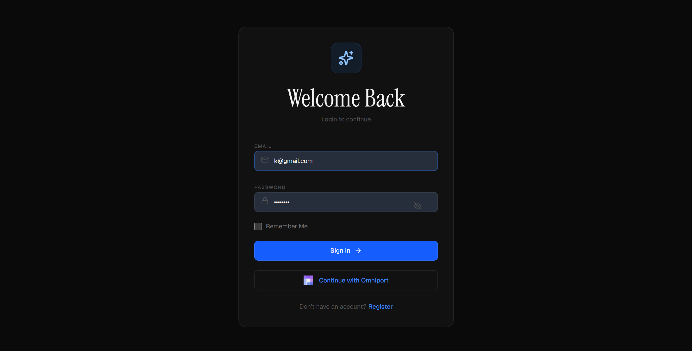

> The main entry point to the application, providing secure authentication. Users can log in using their standard credentials or opt for seamless OAuth integration via Channeli (Omniport).

#### Step 2 — Register Page

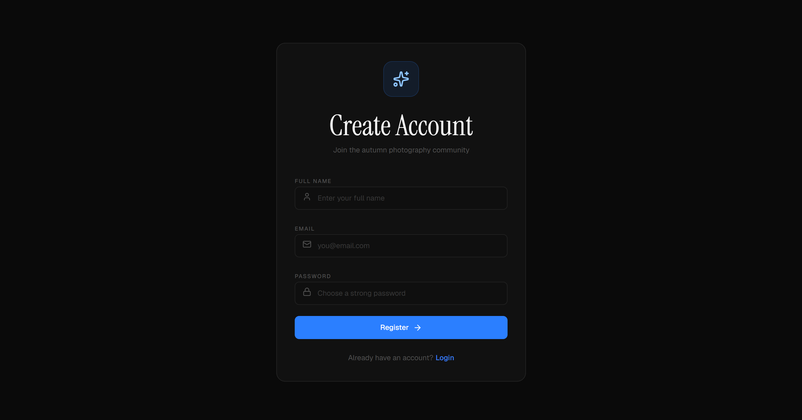

> Allows new users to create an account on the platform. During registration, appropriate default roles are assigned, paving the way for role-based access control.

#### Step 3 — OTP Verification

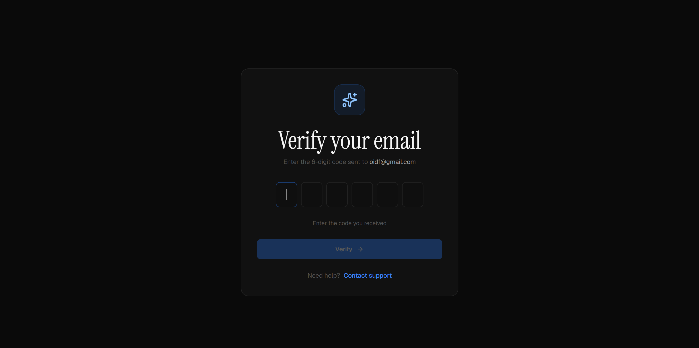

> An essential security step. New users must verify their email addresses via a one-time password (OTP) before gaining access to the platform.

#### Step 4 — Events Page (main listing)

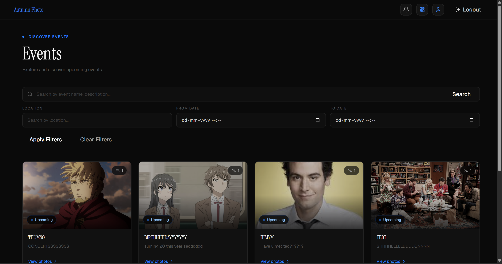

> The central hub for browsing all upcoming and past events. Users can search by event name, filter by location or date, and view event cards featuring high-quality cover photos.

#### Step 5 — Global Search

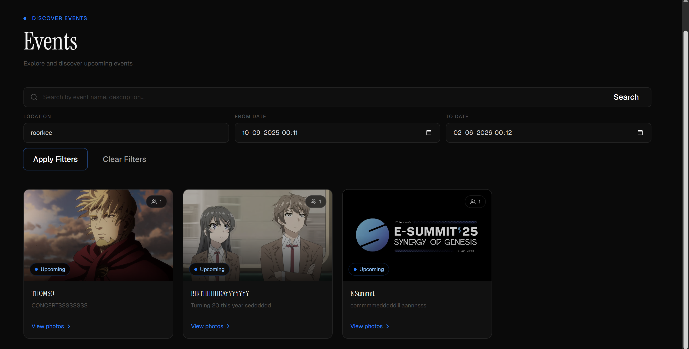

> A powerful global search interface allowing users to quickly find specific events or photos across the entire platform.

#### Step 6 — Event Photos View

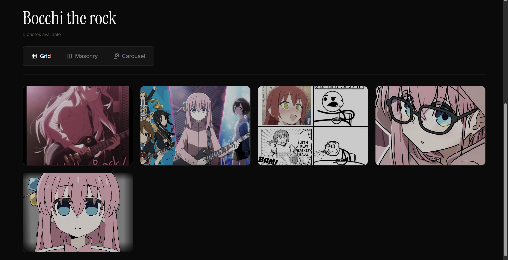

> Clicking into an event reveals its dedicated gallery. Users can toggle between grid, masonry, and carousel viewing modes to browse the uploaded photos effortlessly.

#### Step 7 — Photo Modal

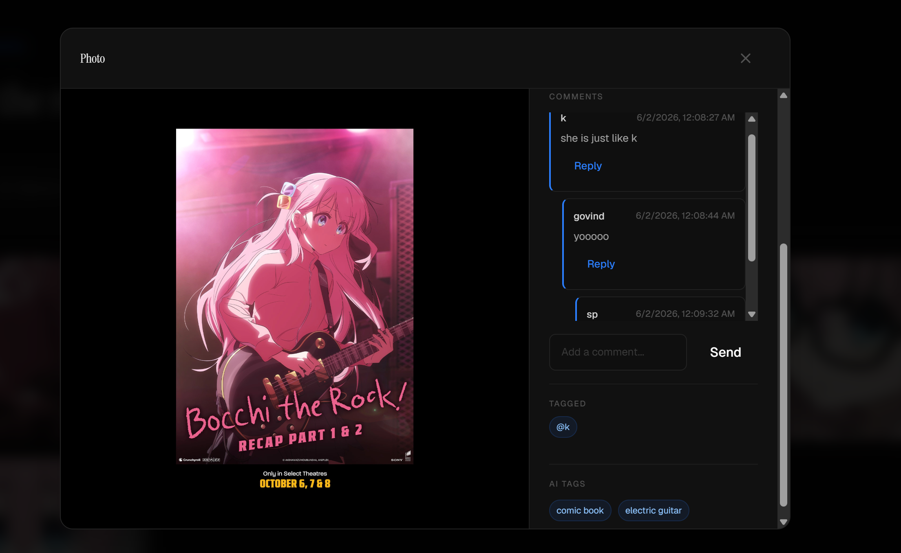

> A full-screen overlay for inspecting an individual photo. It displays AI-generated tags, manually tagged people, and provides quick controls to download the high-resolution image.

#### Step 8 — Photographer Dashboard

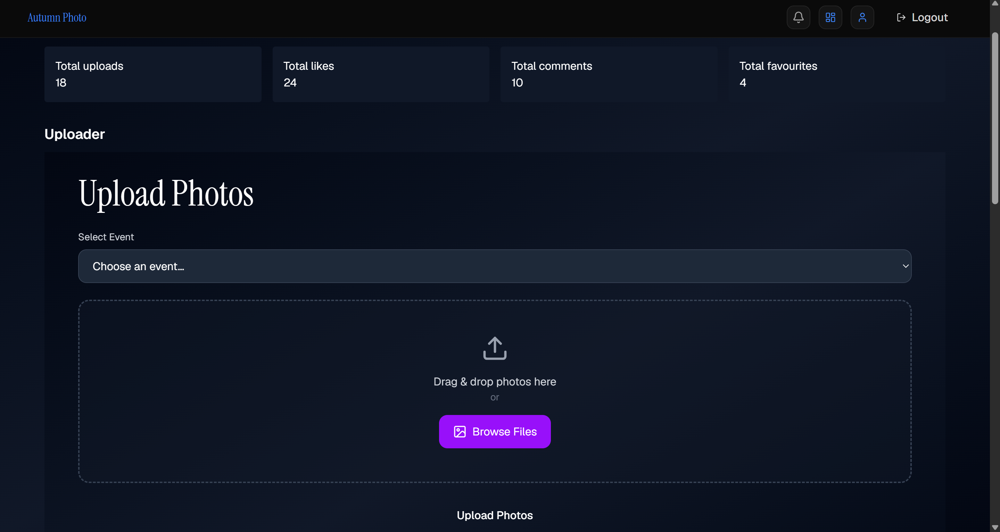

> A specialized workspace for assigned photographers. Here, they can bulk-upload photos to specific events, monitor upload progress, and manage their previously uploaded content.

#### Step 9 — Event Coordinator Dashboard

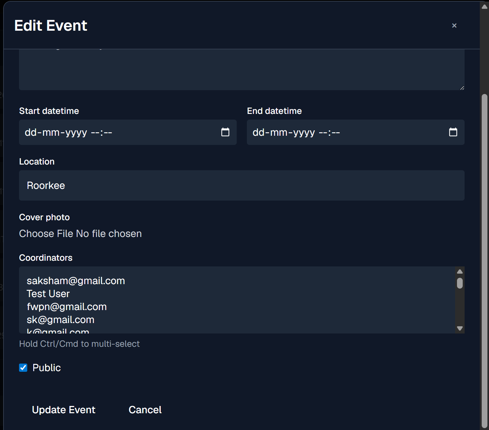

> A control center for event coordinators. Coordinators can view their assigned events and easily edit critical details like the event name, description, dates, location, and cover photo.

#### Step 10 — Admin Panel — Users

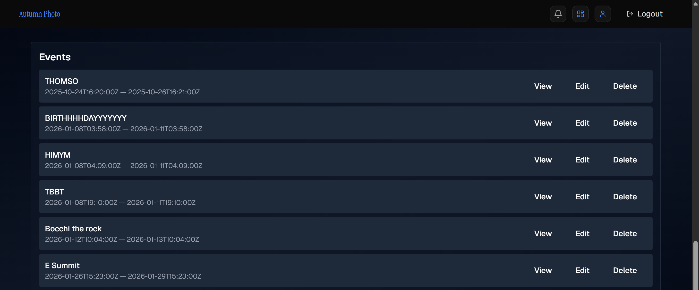

> An administrative interface dedicated to user management. Admins can view the complete list of registered users, modify their roles, or delete user accounts as necessary.

#### Step 11 — Admin Panel — Events

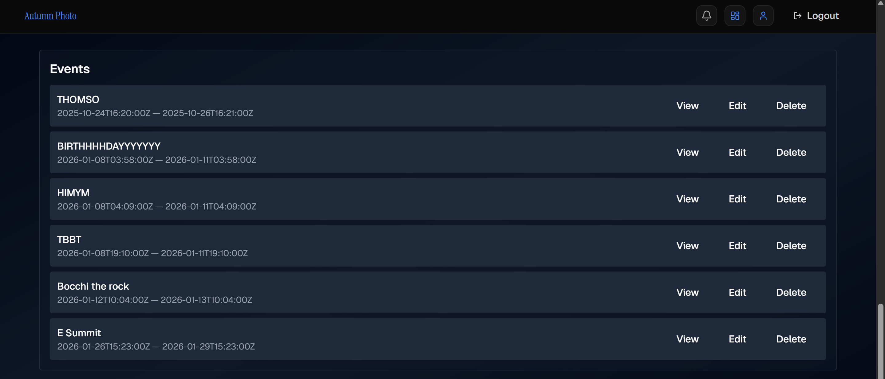

> The master event management interface. System administrators have full CRUD (Create, Read, Update, Delete) permissions over every event in the system, bypassing coordinator restrictions.

#### Step 12 — Admin Panel — Overview

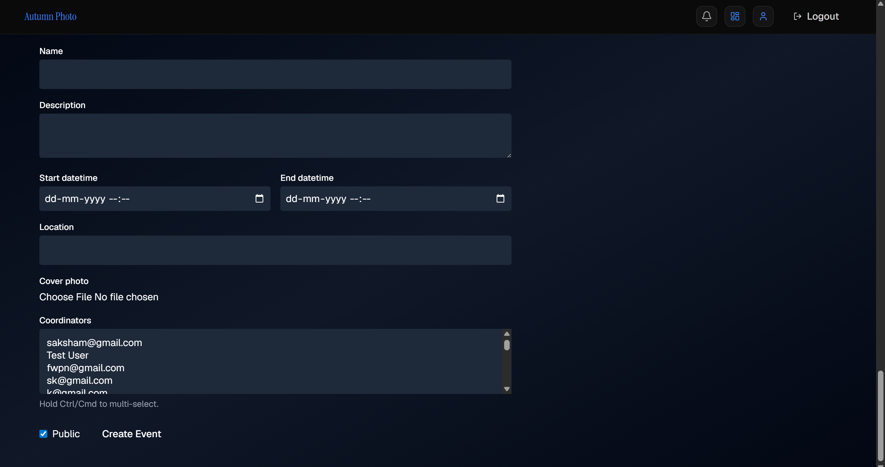

> An additional administrative view providing deeper insights, analytics, or platform-wide configuration settings for superusers.

#### Step 13 — Notifications

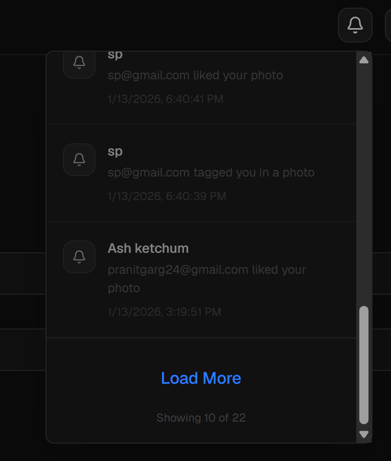

> A real-time notification dropdown accessible from the navigation bar. Users instantly receive alerts when a new photo is uploaded to their events or when someone tags them in a picture.

#### Step 14 — User Profile

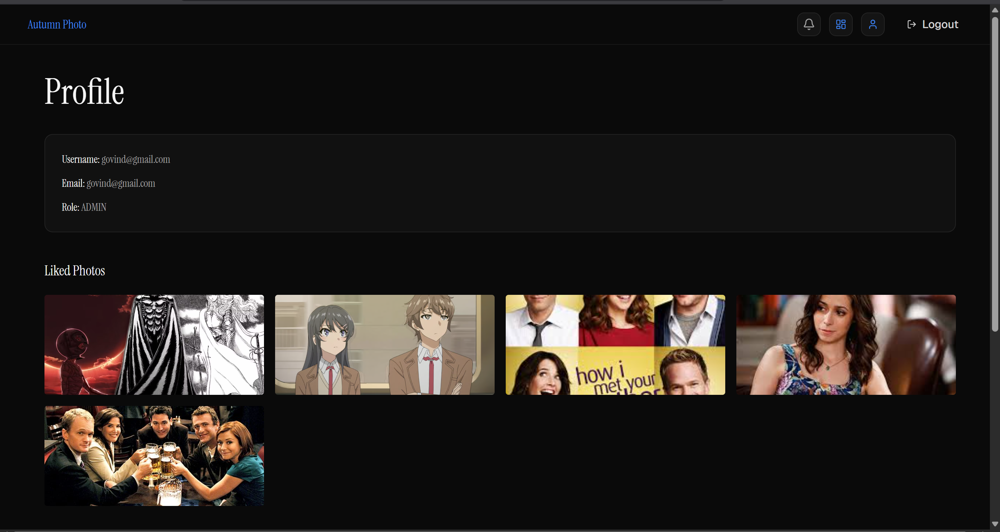

> The user's personal hub. Here, users can manage their account details, change their profile picture, and view their activity history.

#### Step 15 — User Collections


> A personalized gallery space where users can effortlessly access their favourite photos, images they have been tagged in, and photos they have liked across all events.

> 📸 To add screenshots: save images to `docs/screenshots/` using the filenames shown above, then push to the repo. They will render automatically in this README.

---

## ✨ Features

### Core Features
- [x] Event management (create, edit, delete)
- [x] Photo upload with bulk support
- [x] AI-powered photo tagging
- [x] Person recognition and manual tagging
- [x] Advanced search (by tags, users, event info)
- [x] Advanced event filtering (location and date range)
- [x] Nested comments with real-time updates and replies
- [x] Dedicated User Collections (Liked, Tagged, Favourites)
- [x] Grid, Masonry, and Carousel photo views
- [x] Photo modal with full detail view
- [x] Completely redesigned UI with a modern dark theme and electric blue accents
- [x] Refined Photographer and Coordinator Dashboards

### Authentication
- [x] JWT-based auth (simplejwt)
- [x] OTP-based email verification during registration
- [x] Omniport / Channeli OAuth2 integration
- [x] Token refresh with Axios interceptors

### Real-time
- [x] WebSocket notifications via Django Channels
- [x] Redis channel layer
- [x] Celery async task queue for image processing

---

## 👥 User Roles & Permissions

| Role | Permissions |
|------|-------------|
| ADMIN | Full access — manage users, all events, all photos |
| EVENT_COORDINATOR | Create events, edit assigned events, upload photos |
| PHOTOGRAPHER | Upload photos to assigned events |
| MEMBER | View all events and photos |
| PUBLIC | View public events only |

---

## 🛠 Technology Stack

| Backend | Frontend |
|---------|----------|
| Django 6.0, Django REST Framework | React 18 + TypeScript |
| djangorestframework-simplejwt | Vite |
| Django Channels + Redis | Tailwind CSS |
| Celery + Redis broker | Redux Toolkit |
| Pillow (image processing) | Axios (with interceptors) |
| SQLite (dev) / PostgreSQL-ready | Lucide React, React Router v6 |

---

## 🏗 Architecture Diagram

```
┌─────────────────┐
│  React Frontend │
│   (Vite + TS)   │
└────────┬────────┘
         │
         │ HTTP/WebSocket
         │
┌────────▼────────────────────────┐
│      Django Backend             │
│  ┌──────────────────────────┐   │
│  │   REST API (DRF)         │   │
│  ├──────────────────────────┤   │
│  │   WebSocket (Channels)   │   │
│  ├──────────────────────────┤   │
│  │   Celery Tasks           │───┼─────┐ (Async Image Processing)
│  └──────────────────────────┘   │     │
└────────┬────────────────────────┘     │
         │                              │
    ┌────┴────┐                    ┌────▼────┐
    │  Redis  │ ◄────────────────► │ Workers │
    └─────────┘                    └─────────┘
 (Cache + Message Broker)
```

---

## 📦 Prerequisites

- Python 3.10+
- Node.js 18+
- Redis server
- Git

---

## 🚀 Installation & Setup

### A. Clone the repo

```bash
git clone <repository-url>
cd django
```

### B. Backend setup

```bash
# Navigate to backend directory
cd autumn_photo_backend

# Create virtual environment
python -m venv myenv
source myenv/bin/activate  # On Windows: myenv\Scripts\activate

# Install dependencies
pip install -r requirements.txt

# Run migrations
python manage.py migrate

# Create a superuser account
python manage.py createsuperuser
```

Create a `.env` file in the `autumn_photo_backend` directory (see [Environment Variables](#environment-variables) for the template).

### C. Frontend setup

```bash
# Navigate to frontend directory
cd frontend/autumn_photo_frontend

# Install dependencies
npm install
```
> **Note**: Ensure the base URL in `src/services/axiosinstances.ts` points to your active backend (default `http://localhost:8000/api`).

### D. Redis setup

**Windows:**
Download and run Redis from the [Redis Windows Release](https://github.com/microsoftarchive/redis/releases).
```bash
redis-server.exe
```

**Linux/Mac:**
```bash
redis-server
```

---

## 🎮 Running the Application

You will need exactly 4 terminal windows running concurrently:

**Terminal 1: Django Backend**
```bash
cd autumn_photo_backend
python manage.py runserver
```

**Terminal 2: Celery Worker**
```bash
cd autumn_photo_backend
celery -A autumn_photo worker --loglevel=info --pool=solo
```

**Terminal 3: Redis Server**
```bash
redis-server.exe  # On Linux/Mac use: redis-server
```

**Terminal 4: React Frontend**
```bash
cd frontend/autumn_photo_frontend
npm run dev
```

**Accessing the Services:**
- Frontend → `http://localhost:5173`
- Backend API → `http://localhost:8000/api`
- Admin panel → `http://localhost:8000/admin`
- WebSocket → `ws://localhost:8000/ws/notifications/`

---

## 🔌 API Endpoints

### Auth
| Method | Path | Description | Auth Required |
|--------|------|-------------|---------------|
| POST | `/api/auth/login/` | Login with credentials | No |
| POST | `/api/auth/register/` | Register new user | No |
| GET | `/api/auth/omniport/` | Get OAuth redirect URL | No |
| POST | `/api/auth/omniport/callback/`| Process OAuth callback | No |
| POST | `/api/auth/refresh/` | Refresh JWT token | Yes |

### Events
| Method | Path | Description | Auth Required |
|--------|------|-------------|---------------|
| GET | `/api/events/` | List all events | No |
| POST | `/api/events/` | Create a new event | Admin/Coordinator |
| GET | `/api/events/:id/` | Retrieve event details | No |
| PATCH | `/api/events/:id/` | Update event details | Admin/Coordinator |
| DELETE | `/api/events/:id/` | Delete an event | Admin |

### Photos
| Method | Path | Description | Auth Required |
|--------|------|-------------|---------------|
| GET | `/api/events/:id/photos/` | Get photos for an event | No |
| POST | `/api/events/:id/upload/` | Upload photos | Admin/Coordinator/Photographer |
| GET | `/api/photos/search/` | Search photos by tags/users | No |
| POST | `/api/photos/:id/tag/` | Tag person in photo | Yes |
| DELETE | `/api/photos/:id/tag/:tagId/`| Remove person tag | Yes |

### Admin
| Method | Path | Description | Auth Required |
|--------|------|-------------|---------------|
| GET | `/api/adminpanel/users/` | List all users | Admin |
| PATCH | `/api/adminpanel/users/:id/` | Update user role | Admin |
| DELETE | `/api/adminpanel/users/:id/` | Delete user account | Admin |

### Notifications (WebSocket)
| Method | Path | Description | Auth Required |
|--------|------|-------------|---------------|
| WS | `/ws/notifications/` | Real-time WebSocket feed | Yes |

---

## 📝 Environment Variables

Create a `.env` file in the `autumn_photo_backend` directory using this template:

```env
# Core Django settings
SECRET_KEY=your_django_secret_key_here
DEBUG=True
ALLOWED_HOSTS=localhost,127.0.0.1

# Omniport (Channeli) OAuth2 Integration
OMNIPORT_BASE_URL=https://channeli.in
OMNIPORT_CLIENT_ID=your_omniport_client_id
OMNIPORT_CLIENT_SECRET=your_omniport_client_secret
OMNIPORT_REDIRECT_URI=http://localhost:5173/auth/callback

# Redis configuration (for Celery and Channels)
REDIS_HOST=localhost
REDIS_PORT=6379

# Security configurations
CORS_ALLOWED_ORIGINS=http://localhost:5173
```

---

## 📁 Project Structure

```text
django/
├── autumn_photo_backend/          # Django Backend
│   ├── autumn_photo/              # Main configuration & settings
│   ├── accounts/                  # User management & OAuth auth
│   ├── events/                    # Event CRUD & coordination logic
│   ├── photos/                    # Uploads, tagging, Celery image tasks
│   ├── notifications/             # Channels WebSocket consumers
│   ├── adminpanel/                # Admin APIs & role management
│   └── dashboard/                 # User-specific analytical views
├── frontend/
│   └── autumn_photo_frontend/     # React + TypeScript Frontend
│       ├── src/
│       │   ├── app/               # Redux state management configuration
│       │   ├── components/        # Reusable UI components & modals
│       │   ├── pages/             # Route-based page views
│       │   ├── services/          # Axios interceptors & API clients
│       │   └── utils/             # Helper functions and hooks
│       └── package.json           # Frontend dependencies
└── README.md                      # Project documentation
```

---

## 🔧 Key Implementation Notes

### Omniport OAuth Flow
Integration with Omniport's OAuth required addressing several quirks: token endpoints expect `HTTPBasicAuth` rather than form-encoded bodies, user metadata fields are returned in `camelCase`, and cross-origin authentication necessitated specific session cookie security flags (`SameSite=None`, `Secure`).

### Photo Search
Because SQLite lacks direct support for `icontains` on JSONFields, photo searching was optimized by casting the JSON tags payload to strings, allowing simple substring queries alongside relational lookups (tagged users, event names).

### Permission Model
Vistara employs a dynamic Role-Based Access Control (RBAC) model. Specifically, `EVENT_COORDINATOR` and `PHOTOGRAPHER` roles aren't global permissions; custom permission classes explicitly check if the requesting user is linked to the specific event's coordinator list before granting mutation privileges.

### Image Processing Pipeline
To guarantee snappy UI rendering, raw image uploads trigger a background Celery pipeline. A worker processes the original file through Pillow to extract EXIF data and generate optimized 1080p display sizes and 300x300 thumbnails, while simultaneously feeding the image to the AI tagging service.

### WebSocket Notification Flow
The Django Channels consumers use a `user_<id>` channel group strategy, tied closely to Redux on the client-side. When the `markNotificationRead` API is hit, or when tasks finish processing, the channel layer pushes a localized JSON payload directly to the user's active session without polling overhead.

---

## 🤝 Contributing

We welcome community contributions! Please follow the standard branching workflow:

1. Fork the repository
2. Create a feature branch (`git checkout -b feature/amazing-feature`)
3. Commit your changes (`git commit -m 'feat: add amazing feature'`)
4. Push to the branch (`git push origin feature/amazing-feature`)
5. Open a Pull Request

---

## 🙏 Acknowledgements

- The Omniport team
- The open-source communities powering Django, React, Celery, and Channels
